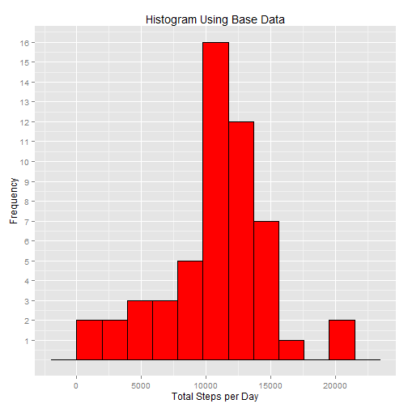
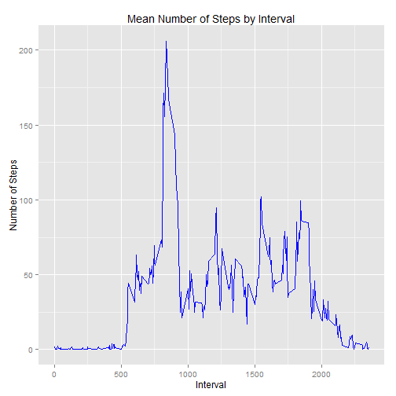
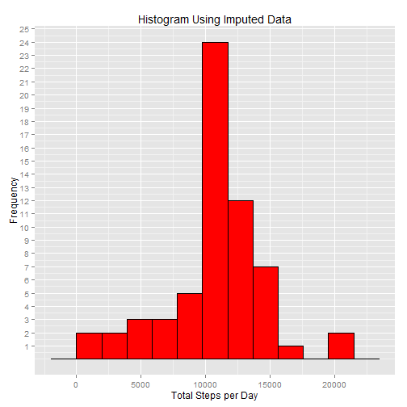
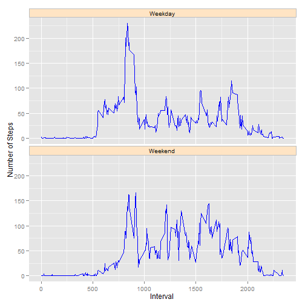

## 1.0 Introduction
This assignment will be described in multiple parts and answers the questions detailed below.  Throughout this report the code that generated the output is made.  This study is broken into the following steps:

1. Introduction
2. Processing
2. Analyze Steps per Day
4. Show Average Daily Activity Pattern
5. Impute Missing Values
6. Analysis of Weekday Versus Weekend Activity

## 2.0 Processing
First step is to set up any special settings for R used in this analysis and provide information about the overall R environment.  There are several additional libraries used that are not in the standard R download.

#### 2.1 Working Environment

```r
library(data.table)
library(date)
library(plyr)
library(dplyr)
library(ggplot2)
setwd("~/R/ReproducibleResearch/PA1")
```

* AMD Athalon X2 Dual-Core QL-65, 2.10 Gz
* 3 GB
* Windows Vista
* 32 bit
* RStudio, Version 0.98.1091
* R Version 3.1.2 (Pumpkin Helmet)

#### 2.2 Data for Study
Next step is to load the data for the study.  The data was originally in compressed form at  <https://d396qusza40orc.cloudfront.net/repdata%2Fdata%2Factivity.zip> and was downloaded and  decompressed to my local drive as activity.csv to be read into my local copy of R.

```r
df.activity <- fread("activity.csv", data.table=F)
```
Here is the structure of the data read in:

```r
str(df.activity)
```

```
## 'data.frame':	17568 obs. of  3 variables:
##  $ steps   : int  NA NA NA NA NA NA NA NA NA NA ...
##  $ date    : chr  "2012-10-01" "2012-10-01" "2012-10-01" "2012-10-01" ...
##  $ interval: int  0 5 10 15 20 25 30 35 40 45 ...
```
Here is a summary of the data read in:

```r
summary(df.activity)
```

```
##      steps            date              interval     
##  Min.   :  0.00   Length:17568       Min.   :   0.0  
##  1st Qu.:  0.00   Class :character   1st Qu.: 588.8  
##  Median :  0.00   Mode  :character   Median :1177.5  
##  Mean   : 37.38                      Mean   :1177.5  
##  3rd Qu.: 12.00                      3rd Qu.:1766.2  
##  Max.   :806.00                      Max.   :2355.0  
##  NA's   :2304
```
At this point, the dates, which were read in as a character class, needs to be transformed into a date class.  Create a data table to sum up steps for each day.

```r
df.activity[,"date"] <- as.Date(df.activity[,"date"])
rollUpSteps <- summarise(group_by(df.activity, date), steps=sum(steps))
print("Summary of transformed rolled up data set:")
```

```
## [1] "Summary of transformed rolled up data set:"
```

```r
summary(rollUpSteps)
```

```
##       date                steps      
##  Min.   :2012-10-01   Min.   :   41  
##  1st Qu.:2012-10-16   1st Qu.: 8841  
##  Median :2012-10-31   Median :10765  
##  Mean   :2012-10-31   Mean   :10766  
##  3rd Qu.:2012-11-15   3rd Qu.:13294  
##  Max.   :2012-11-30   Max.   :21194  
##                       NA's   :8
```

## 3.0 Analyze Steps per Day

#### 3.1 Histogram of Steps per Day

```r
tsPlot <- ggplot(rollUpSteps, aes(x=steps)) 
tsPlot <- tsPlot + labs(title="Histogram Using Base Data",
                        x="Total Steps per Day",
                        y="Frequency")
tsPlot <- tsPlot + geom_histogram(binwidth=1952, colour='black', fill='red')
tsPlot <- tsPlot + scale_y_continuous(breaks=1:25)
tsPlot
```

 


#### 3.2 Mean and Median of Steps per Day

```r
meanStepDay <- mean(rollUpSteps$steps, na.rm = T)
medianStepDay <- median(rollUpSteps$steps, na.rm = T)
```

```
## [1] "Mean steps per day = 10766.1886792453"
```

```
## [1] "Median steps per day = 10765"
```

## 4.0 Average Daily Activity Pattern

#### 4.1 Summarize
Group the data by interval and calculate the mean steps for each interval.

```r
rollUpInterval <- summarise(group_by(df.activity, interval), msteps=mean(steps, na.rm=T))
```

#### 4.2 Time Series Plot

```r
tsPlot <- ggplot(data=rollUpInterval, aes(interval, msteps)) + geom_line(colour="blue")
tsPlot <- tsPlot + labs(title="Mean Number of Steps by Interval",
                        x="Interval",
                        y="Number of Steps")
tsPlot 
```

 

#### 4.3 Maximum Interval

```r
maxSteps <- max(rollUpInterval[,'msteps'])
maxInterval <- rollUpInterval[rollUpInterval$msteps==maxSteps, 'interval']
```
The 5-minute interval, on average across all the days in the dataset, contains the maximum number of steps = 835


## 5.0 Impute Missing Values

#### 5.1 Missing Values

```r
df.fix <- df.activity[is.na(df.activity$steps),]
missingValues <- nrow(df.fix)
```
Missing Values = 2304

#### 5.2 Impute Missing Values
Use the dataframe created for average daily activity pattern and use those to impute the values for incomplete cases. Created a new dataset that is equal to the original dataset but with the missing data filled in using the mean steps taken for that interval.

```r
df.imputed <- join(df.fix, 
                   rollUpInterval,
                   by="interval")[,c('msteps' , 'date', 'interval')]
colnames(df.imputed) <- c('steps', 'date', 'interval')
df.activityImputed <- rbind(df.imputed,
                            df.activity[!is.na(df.activity$steps),])
rollUpStepsImputed <- summarise(group_by(df.activityImputed, date),
                                steps=sum(steps))
```

#### 5.3 Histogram of Total Number of Steps

```r
tsPlot <- ggplot(rollUpStepsImputed, aes(x=steps)) 
tsPlot <- tsPlot + labs(title="Histogram Using Imputed Data",
                        x="Total Steps per Day",
                        y="Frequency")
tsPlot <- tsPlot + geom_histogram(binwidth=1952, colour='black', fill='red')
tsPlot <- tsPlot + scale_y_continuous(breaks=1:25)
tsPlot
```

 


#### 5.4 Compare Data with Imputed Values to Original Data
Calculate mean and median for imputed data.

```r
meanStepDayImputed <- mean(rollUpStepsImputed$steps)
medianStepDayImputed <- median(rollUpStepsImputed$steps)
```

```
## [1] "Mean steps per day (Imputed) =  10766.1886792453"
```

```
## [1] "Median steps per day (Imputed) =  10766.1886792453"
```

#### 5.5 Differences Using Imputed Data

```r
difMean <- meanStepDayImputed - meanStepDay
difMedian <- medianStepDayImputed - medianStepDay
difTotalSteps <- sum(rollUpStepsImputed$steps) - 
                 sum(rollUpSteps$steps, na.rm=T)
```

```
## [1] "Change in mean steps per day using imputed data = 0(no significant change in mean steps per day)"
```

```
## [1] "Change in median steps per day using imputed data = 1.1886792452824(small increase in median steps per day)"
```

```
## [1] "Increase in total steps = 86129.5094339623"
```

## 6.0 Analysis of Weekday Versus Weekend Activity

#### 6.1 Create Dataset with Weekday and Weekend Factors

```r
weekEnd <- factor(ifelse(weekdays(df.activityImputed$date)%in%c("Sunday","Saturday"),
                         "Weekend", "Weekday"))
df.activityImputed <- cbind(weekEnd, df.activityImputed)
rollUpIntervalImputed <- summarise(group_by(df.activityImputed, weekEnd, interval),
                                   msteps=mean(steps))
```

#### 6.2 Panel Plot

```r
tsPlot <- ggplot(data=rollUpIntervalImputed, aes(x=interval, y=msteps))
tsPlot <- tsPlot + geom_line(colour="blue")
tsPlot <- tsPlot + labs(x="Interval")
tsPlot <- tsPlot + labs(y="Number of Steps")
tsPlot <- tsPlot + facet_wrap(~weekEnd, ncol=1)
tsPlot <- tsPlot + theme(strip.background = element_rect(colour="grey", fill="bisque1"))
tsPlot
```

 
